# Avela UX Audit & Design Proposal

Date: 2026-10-03. Scope: Today, habit creation/editing, habit detail, archive/
reactivation, History/filtering, weekly Insights. No product code was changed
to produce this document — see "Method" below for how screenshots were
captured without modifying the app or its tests.

This document does not cover attention tracking, the companion, notifications,
purchases, Screen Time, production widgets, Live Activities, or onboarding —
none of that is implemented yet, per MVP.md and prior slices.

## Method

- Re-read root `AGENTS.md`, `docs/AGENTS.md`, and every other Markdown file
  under `docs/` before auditing. No uncommitted changes existed beyond the
  prior Insights slice; nothing was stale.
- Confirmed the baseline unchanged: 112 unit tests, 16 UI tests, both via a
  fresh `xcodebuild test` run (see `docs/SETUP.md`'s history for exact
  commands; not re-logged here since this pass made no code changes).
- **Screenshots**: this environment has no Simulator.app GUI and no `idb`
  installed, so there is no way to interact with the simulator by clicking.
  Instead of writing new test/driver code (which this pass's brief
  explicitly prohibits), the existing, *unmodified* `AvelaUITests` suite was
  run twice as a pure interaction driver: once to confirm Xcode's automatic
  UI-test screenshot attachments were unavailable in this environment (they
  were — the default test plan discards them on success), and once more
  while a separate, read-only shell loop polled
  `xcrun simctl io booted screenshot` every ~0.35s and kept only frames that
  changed (hashed, deduped). The loop and its screenshots are not part of the
  app or test target; nothing was added to the Xcode project. The resulting
  ~350 frames were correlated to specific tests using the run's recorded
  wall-clock test boundaries, and a representative subset was selected for
  this document (saved under `docs/audit-screenshots/`).
- **Coverage gap, stated up front**: because the existing UI tests only
  exercise *today's* actions, and Insights deliberately never displays the
  in-progress current week, no screenshot shows Insights' actual populated
  summary card (overall %, strongest habit, needs-attention). Empty and
  insufficient-data states are captured; the populated state is addressed
  under "Smallest DEBUG fixture approach" below.
- Dark mode, Dynamic Type at large sizes, VoiceOver traversal, and Reduce
  Motion were **not** empirically verified — this environment cannot drive
  Accessibility Inspector or toggle system settings on the simulator without
  interaction. These are called out explicitly as hypotheses needing a real
  device/Simulator.app pass, not claimed as confirmed.

---

## Part 0 — Insights rule-compliance review (performed first, as requested)

> **Update (correctness pass, same day):** Rules 1 and 2 below were
> originally reported here without being fixed, per that pass's "audit only,
> no code changes" scope. Both have since been fixed in a dedicated
> follow-up pass — see `docs/DATA_MODEL.md`'s "Audit-driven correctness
> fixes" and "Trend comparable-cohort rules" sections for the shipped
> behavior, and the real screenshots in Part 1 below (F9, F15) for visual
> confirmation. The analysis and concrete reproductions below are left as
> originally written, as the record of what was found and why; each
> sub-heading now also states its resolution.

Reviewed `Avela/Features/Insights/Domain/WeeklyInsightsCalculator.swift`
(unchanged since the last slice) against the three agreed rules. No product
code was changed in *this* review pass; the two real gaps below were
reported, not silently fixed, at the time this section was written.

### Rule 1 — Trend cohort/schedule comparability: **not met at the time of this review; fixed in the follow-up pass**

> "Trends must compare the same eligible habit cohort across both weeks, with
> compatible schedules/tracking periods. Having one eligible habit in each
> week alone is insufficient."

Current code (`weeklyInsights`):

```swift
let eligibleHabits = summaries(in: weekInterval)
let previousEligibleHabits = summaries(in: previousWeekInterval)
...
previousWeekOverallConsistency: average(of: previousEligibleHabits)
```

`trendInPercentagePoints` only checks that *both* weeks independently have
`overallConsistency != nil` — i.e., at least one eligible habit *somewhere*
in each week. It never checks that it's the *same* habit(s), nor that a
shared habit's schedule was comparable between the two weeks.

**Concrete example (not currently covered by any test):**

- Habit "Journal" is created on the first day of week W (daily), completes
  every day → 100% for week W. It did not exist in week W−1.
- Habit "Meditate" was archived before week W began, but was active and
  tracked during week W−1, where it scored 2/7 ≈ 28.6%.
- `weeklyInsights(weekInterval: W, previousWeekInterval: W-1, ...)` produces:
  `eligibleHabits(W) = [Journal: 100%]`, `eligibleHabits(W-1) = [Meditate: 28.6%]`,
  `overallConsistency(W) = 1.0`, `previousWeekOverallConsistency(W-1) = 0.286`,
  `trendInPercentagePoints ≈ +71`.

The UI would read "Up 71 percentage points from the prior week" — comparing
two entirely different habits that happen to both have been eligible in
their respective weeks. That is exactly the "one eligible habit in each week
alone is insufficient" case the rule calls out, and today's code treats it as
a perfectly valid trend.

A second, narrower instance of the same rule: even when it *is* the same
habit in both weeks, if its schedule changed (e.g., daily → `timesPerWeek(1)`
between the two weeks), the two percentages measure different things — "5 of
7 days" vs. "1 of 1 week" are not the same unit of commitment, even though
both are valid percentages on their own. The current code has no check for
this either.

**This is a real, user-visible correctness gap**, not a hypothetical — it
requires no edge-case data (a brand-new habit and an archived one, or a
mid-stream schedule edit, are both common real usage patterns). No
regression test in `WeeklyInsightsCalculatorTests.swift` catches it: the
existing trend tests use either the same single habit in both weeks or a
previous week with *no* eligible habits at all, never "a different eligible
habit in each week."

> **Fixed.** `WeeklyInsightsCalculator` now computes the trend only over a
> "comparable cohort": habits eligible in both weeks, with an unchanged
> `HabitSchedule` (polarity-only edits excluded from counting as a change)
> and no archive/reactivation anywhere across the two-week span, and whose
> `scheduledUnits` for each week matches the full expected count for their
> schedule kind. See `docs/DATA_MODEL.md`'s "Trend comparable-cohort rules"
> for the exact, documented rule set, and
> `WeeklyInsightsCalculatorTests`' "Trend comparable-cohort rules" section
> (5 new tests) plus the UI-level
> `testInsightsShowsAValidTrendForAComparableHabit` and
> `testInsightsShowsNotEnoughComparableDataWhenScheduleChangedBetweenWeeks`
> for verification. Confirmed visually — see F15's updated screenshots below.

### Rule 2 — Balanced summary when results are identical: **not met at the time of this review; fixed in the follow-up pass**

> "When all eligible habits have identical results, use a balanced summary
> instead of strongest/weakest callouts."

Current code computes `strongestHabitNames` and `habitsNeedingAttentionNames`
independently:

```swift
let maxPercentage = eligibleHabits.map(\.percentage).max() ?? 0
let strongestHabitNames = maxPercentage > 0
    ? eligibleHabits.filter { $0.percentage == maxPercentage }.map(\.habitName).sorted()
    : []

let habitsWithMisses = eligibleHabits.filter { $0.missedUnits > 0 }
let minPercentageAmongMisses = habitsWithMisses.map(\.percentage).min()
let habitsNeedingAttentionNames = minPercentageAmongMisses.map { minPercentage in
    habitsWithMisses.filter { $0.percentage == minPercentage }.map(\.habitName).sorted()
} ?? []
```

**Concrete example — and this is the common case, not an edge case:** a user
with a *single* habit that had any miss that week (say 5/7 = 71%, the modal
early-usage scenario for most real users who start with one or two habits):

- `maxPercentage = 0.714 > 0` → `strongestHabitNames = ["Walk"]`
- `habitsWithMisses = [Walk]`, `minPercentageAmongMisses = 0.714` →
  `habitsNeedingAttentionNames = ["Walk"]`

**The same habit is named both "Strongest" and "Needs Attention" in the same
review.** This is not a rare multi-habit tie — it happens for *any* single
habit with a partial (neither 0% nor 100%) week, which is the ordinary case,
not an edge case. The identical-habits-tied case the rule's wording leads
with (e.g., two habits both at 71%) produces the same contradiction, just
with more names. No existing test in `WeeklyInsightsCalculatorTests.swift`
exercises the single-habit-with-a-miss case against both callouts
simultaneously — the tests check each callout's tie-handling in isolation.

Because of how common the single-habit case is, this is the **highest-
priority correctness item in this review** — it will surface for a large
fraction of real early users, not a constructed edge case.

> **Fixed.** `WeeklyInsights.isBalancedWeek` is now `true` whenever every
> eligible habit shares the exact same percentage, including the
> single-habit case; `strongestHabitNames` and `habitsNeedingAttentionNames`
> are both empty when it is, and `InsightsView` shows a neutral sentence
> instead ("All 2 habits were equally consistent this week (71%)." / "{name}
> was your only tracked habit this week ({percent})."), built from each
> habit's real preserved `successfulUnits`/`scheduledUnits`. See
> `WeeklyInsightsCalculatorTests`' "Balanced weeks" section (2 new tests) and
> the real screenshot at F15 below —
> `testInsightsShowsBalancedSummaryForIdenticalResults` confirms this on
> device, not just in the calculator.

### Rule 3 — Eligibility excludes excused skips and pending periods: **confirmed correct**

Traced `HabitProgressCalculator.consistency`:

```swift
let inRange = units.filter { $0.periodStart >= range.start && $0.periodStart < range.end }
let successes = inRange.filter { $0.outcome == .success }.count
let misses = inRange.filter { $0.outcome == .miss }.count
return ConsistencyResult(successfulUnits: successes, scheduledUnits: successes + misses)
```

`scheduledUnits` is built only from `.success` and `.miss` outcomes; `.skip`
and `.pending` units are present in `inRange` but never counted into either
bucket. `WeeklyInsightsCalculator`'s eligibility gate
(`result.scheduledUnits > 0`) therefore already excludes excused skips and
the still-open/pending boundary period from the resolved-commitment
denominator, exactly as required. `WeeklyInsightsCalculatorTests
.testSkipsAreExcusedFromBothNumeratorAndDenominator` already locks this in
at the calculator level. **No gap found here — confirmed, not changed.**

### What was and wasn't done

At the time this section was originally written, per that pass's explicit
"audit only" brief, **no code was changed** to fix Rules 1 or 2 — they were
reported here with concrete reproductions for a future pass to fix
deliberately. That future pass happened the same day: both are now fixed,
exactly along the lines sketched above (comparable-cohort intersection for
the trend; a balanced-week flag suppressing both rankings), with the precise
rules documented in `docs/DATA_MODEL.md` rather than left as "exactly how to
define compatible schedule is a product call" — see the inline "Fixed"
notes above for what shipped and where it's tested.

---

## Part 1 — Prioritized audit with screenshot evidence

Severity: **Critical** (breaks a basic interaction) · **High** (visible,
likely to confuse most users) · **Medium** (real but narrower impact) ·
**Low** (polish). Each finding is marked **Observed** (seen directly in a
screenshot or traced in code) or **Hypothesis** (plausible, needs user
testing or device verification — listed separately in the usability script).

### Resolved since this audit

**F9 — Archive confirmation dialog shows no visible way to cancel. RESOLVED.**
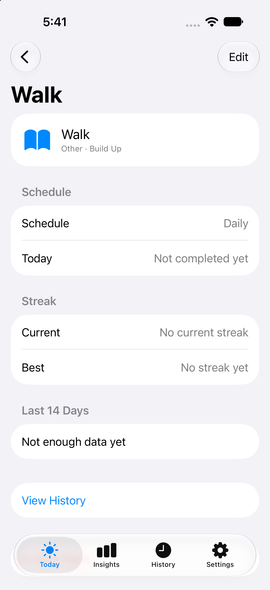
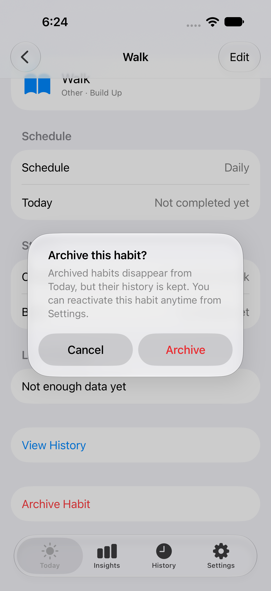

Originally reported as Critical, with the cause unconfirmed because the
screenshot above was captured by an external, unsynchronized `simctl` poller
with no knowledge of XCUITest's own element tree — it could not distinguish
"still presenting" from "genuinely missing." A follow-up UI test,
`testArchiveConfirmationCanBeCancelledLeavingTheHabitActive`, instead waits
for `app.buttons["Archive"]` and `app.buttons["Cancel"]` to exist (5s
timeout) before asserting anything or taking evidence. Result: **the Cancel
button was confirmed genuinely absent from the accessibility tree** when
presented via `.confirmationDialog` from a row inside a `List` on this
toolchain — a real functional defect (no reachable way back for VoiceOver or
Full Keyboard Access users), not merely a discoverability issue the original
finding left open as a possibility.

**Fix**: switched `HabitDetailView`'s archive confirmation from
`.confirmationDialog` to a plain `.alert` — SwiftUI's standard native
two-button confirm/cancel presentation, not a custom overlay. The second
screenshot above is the real, settled result: a centered modal with both
"Cancel" and "Archive" clearly visible and separately tappable. The same UI
test now passes, and additionally confirms cancelling leaves the habit
active with no archive period recorded (Settings' Archived Habits stays
empty). No other screen in the app uses `.confirmationDialog`, so this
toolchain-specific issue has no other occurrence to check.

**F15 — Insights' actual populated summary card was unverified visually. RESOLVED.**
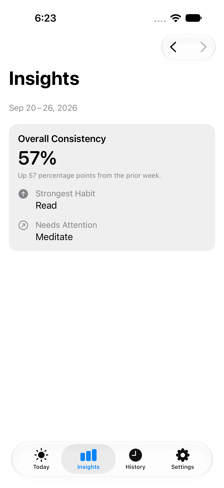
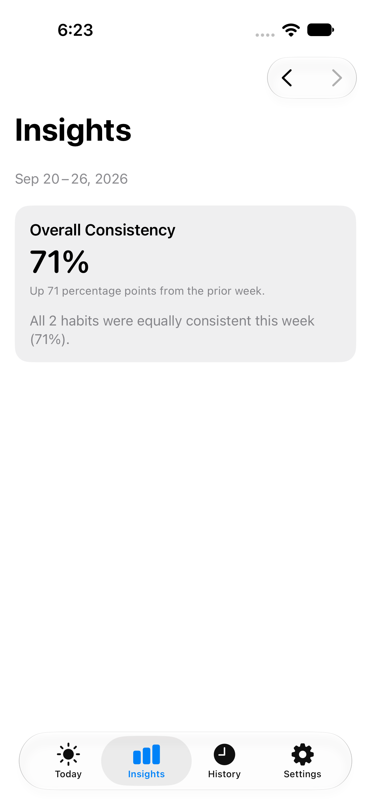
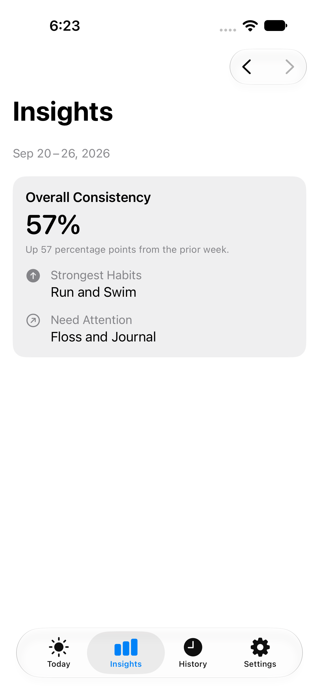
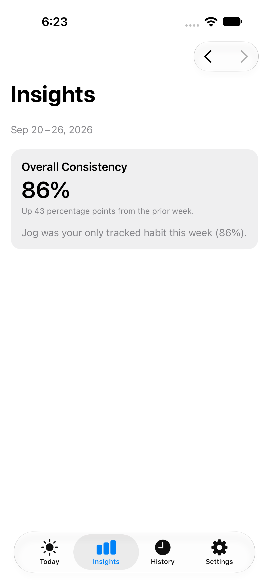
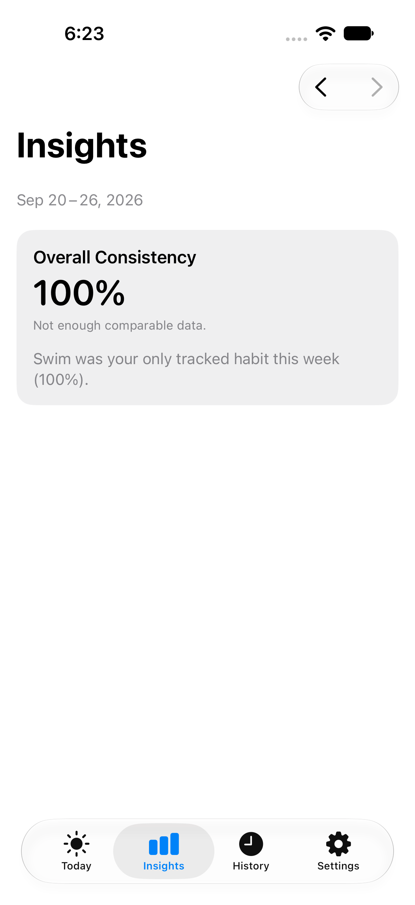

The DEBUG fixture approach proposed below was implemented (see
`docs/DATA_MODEL.md`'s "Populated-Insights DEBUG fixtures") and used to
capture all five states above on device, after Part 0's Rule 1/2 fixes
landed. The card reads cleanly at real sizes: one bold percentage, a
one-line trend sentence, and at most two short callout rows — in line with
DESIGN_SYSTEM.md's "short readable review, not a dense analytics dashboard,"
not the self-contradictory "Strongest: Walk / Needs Attention: Walk" the
original (unfixed) logic would have produced for the single-habit case. The
balanced-week screenshot confirms the neutral-summary fix reads naturally in
place of a ranking. No further visual-design work is blocked on this now;
remaining visual polish (spacing, card styling under a chosen accent
direction) is still future work per Part 6's phased plan.

### High

**F4 — Habit creation/editing sheet uses a large, left-aligned title like a
pushed screen, not a modal sheet. RESOLVED.**
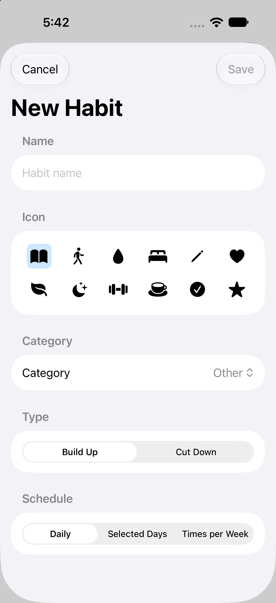
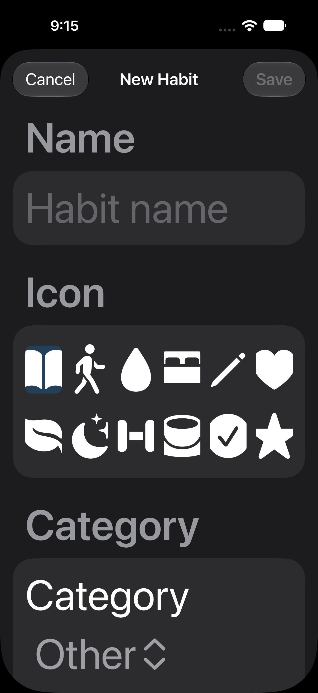

Standard iOS modal sheets for quick data entry (Reminders' "New List", Mail's
"New Message", Calendar's "New Event") use a compact, centered title next to
Cancel/Save. `HabitFormView` instead showed "New Habit"/"Edit Habit" as a
large, bold, left-aligned title — the same visual treatment as a tab root
(Today, Settings) — consuming significant vertical space before the first
field and reading more like a deep navigation destination than a quick add
sheet. Confirmed consistently across three independent captures (new-habit
flow twice, edit-habit flow once).

**Fix**: added `.navigationBarTitleDisplayMode(.inline)` — a one-line change,
not a redesign. Visually confirmed in the habit-form screenshots captured for
F5 below (`24-habitform-dark-accessibilityXXXL.png` and
`29-habitform-light-accessibilityXXXL.png`): "New Habit" now renders compact
and centered next to Cancel/Save, matching platform convention.

### Resolved (second pass) — F12, F2, F5

**F12 — The same habit's icon is accent-tinted on Today/Detail but gray in History. RESOLVED.**
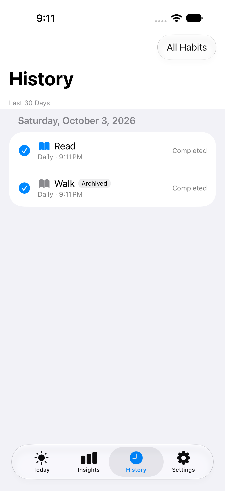

`HistoryRowView` always rendered the habit icon with `.foregroundStyle(.secondary)`,
regardless of archived state — archived-vs-active was correctly communicated
by the separate "Archived" text badge, not icon color. But `TodayView` and
`HabitDetailView` both tinted the *same* habit's icon with `Color.accentColor`
unconditionally, including for an *archived* habit in `HabitDetailView`'s
case. A user scanning from Today (blue book icon for "Walk") to History (gray
book icon for the same still-active "Walk") could reasonably read the gray
icon as "this habit must be archived," since gray-vs-accent is exactly the
signal `ArchivedHabitsView` uses for that distinction (F10).

**Fix**: `HistoryView` and `HabitDetailView` both now use
`isArchived ? Color.secondary : Color.accentColor`, matching `TodayView`
(only ever shows active habits, already accent-tinted) and
`ArchivedHabitsView` (only ever shows archived habits, already secondary).
The "Archived" text badge remains the authoritative signal either way — this
only makes icon color agree with it instead of contradicting it on one
screen. Icon tint *color* has no XCUITest API to query directly, so
`testArchivedAndActiveHabitIconsAppearTogetherInHistoryForVisualTintComparison`
automates the behavioral part (the "Archived" badge's presence, confirmed) and
the linked screenshot provides the visual confirmation of the tint itself —
"Read" (active) renders in accent blue, "Walk" (archived) in gray, in the
same History list.

**F2 — Avoidance ("Cut Down") polarity isn't reflected in Today's completion language. RESOLVED.**

`HabitFormView` and `HabitDetailView` both show "Build Up"/"Cut Down" for
polarity, and `Habit.swift`'s own doc comment states "polarity only changes
how UI should phrase progress" — but `TodayView`'s row and its completion
button's accessibility labels ("Mark {name} complete" / "Undo completion for
{name}") were identical regardless of polarity.

**Fix**: new `HabitPolarityFormatter` (see `docs/DATA_MODEL.md`'s "Phase 1
small UX fixes") provides polarity-aware wording used by both `TodayView`'s
completion button and `HabitDetailViewModel`'s new `todayStatusLabel`. For
`avoidance` habits: "Log success for {name}" / "Undo success for {name}" /
"Logged"/"Not logged yet" — deliberately not "Mark avoided," which the task
that requested this fix specifically flagged as unsafe: it would assume
every Cut Down habit means total abstinence, when one like "Cut down on late
snacking" can be satisfied by a reduced amount. Verified end-to-end (Today's
button label *and* Detail's status field) by
`testTodayAndDetailUsePolarityAwareWordingForAvoidanceHabits`, plus 6 new
unit tests on `HabitPolarityFormatter` directly. All existing tests use the
default `positive` polarity and were unaffected, since that wording didn't
change.

**F1 — Today's empty vertical space below one or two habit rows.**
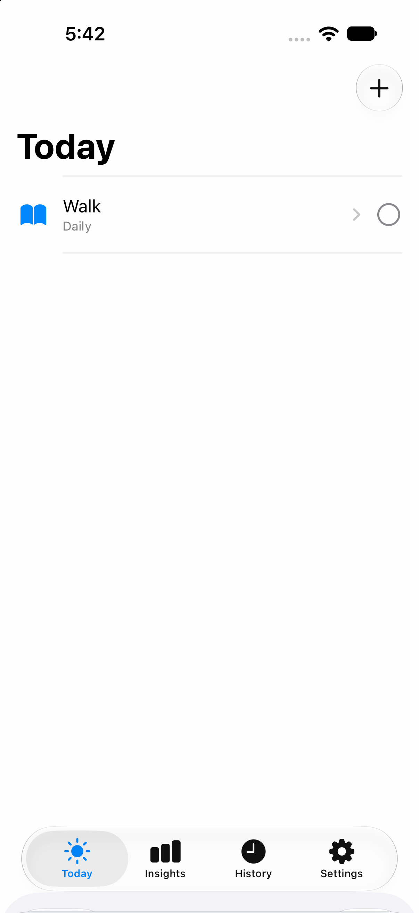

With few habits, Today is a single row followed by a very large blank area
down to the tab bar. Not wrong (UX.md explicitly wants Today "calm," not
dashboard-like), but a layout opportunity — this is exactly the space a
future companion view or a light "how's today going" summary could occupy
without the screen becoming data-heavy. **Not addressed this pass** —
explicitly out of scope ("do not fill Today's empty space"); still Phase 4.

**F5 — Icon grid touch targets (hypothesis, needs measurement). RESOLVED — was a confirmed violation, not just a hypothesis.**

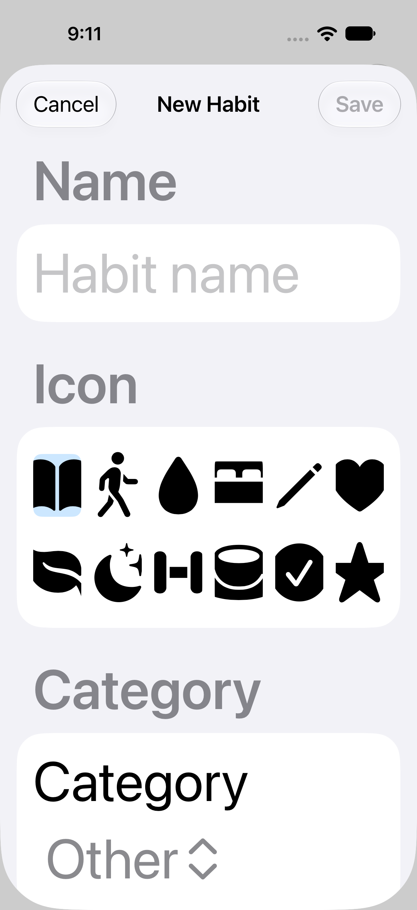

The 6-column icon grid rendered each icon in a fixed 36×36pt frame — below
Apple's 44×44pt touch-target minimum (UX.md: "sufficient touch targets").
Measuring this required a UI test reading each button's actual rendered
`frame`, not just its SwiftUI source values — confirmed the violation
directly (36pt, not merely "unmeasurable from a screenshot" as originally
left open).

**Fix**: replaced the fixed 6-column `LazyVGrid` with
`GridItem(.adaptive(minimum: 44, maximum: 64))` and each icon button's frame
with `minWidth: 44, minHeight: 44` — the grid now recomputes how many
columns fit, reflowing to fewer, larger columns as Dynamic Type grows the
icons (visible above: fewer, larger icons per row at
`UICTContentSizeCategoryAccessibilityXXXL` than at the default size).
Verified by `testIconPickerTouchTargetsAreAtLeast44Points` and
`testIconPickerTouchTargetsRemainAtLeast44PointsAtLargeDynamicType`, both
reading `XCUIElement.frame` directly. The first run of the default-size test
failed at `43.99999999999994 < 44.0` — genuine SwiftUI layout floating-point
noise around a visually-exact 44pt target, not an actually undersized
element — fixed by rounding the measured frame to the nearest point before
comparing.

### Low / Positive (worth preserving)

**F7 — Inconsistent "nothing yet" phrasing on one screen. RESOLVED.**


One detail screen showed four different phrasings for "no data yet": "Not
completed yet," "No current streak," "No streak yet," "Not enough data yet."
Each was individually honest and well-worded; three of the four already ended
in "yet," only "No current streak" broke that pattern.

**Fix**: changed the zero-text to "No current streak yet" — a pure wording
fix. The four strings' distinct *meanings* are unchanged and still
intentionally separate: today's own resolution ("Not completed yet"/"Not
logged yet" per F2), no streak presently in progress ("No current streak
yet"), no streak ever achieved — a lifetime fact ("No streak yet"), and the
14-day consistency window having no resolved units at all ("Not enough data
yet"). Merging any of these was never the ask; only the pattern needed to
agree. Verified by `HabitDetailViewModelTests
.testNoStreakYetWhenNothingCompleted`, updated for the new string.

**F8 — "View History" has no chevron/icon signaling navigation.**
Relies solely on blue-link coloring (standard enough iOS convention) to
signal it leads elsewhere. Worth a quick comprehension check in user testing
(included in the script below) rather than assuming it's fine or broken.

**F10 (positive) — Archived rows correctly de-emphasize with a gray icon.**
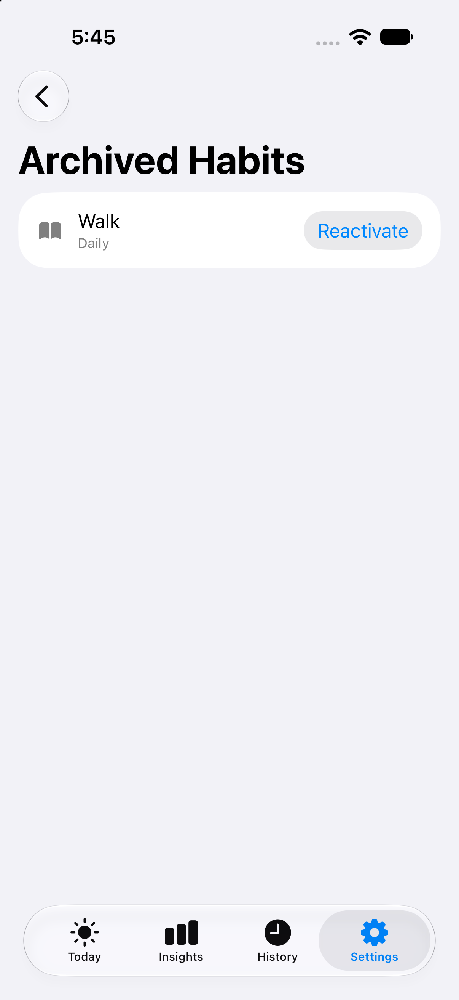

Clear, consistent, non-verbal "inactive" signal. Keep this pattern — just
resolve its collision with F12 above by not reusing gray-vs-accent
differently on another screen.

**F13 (positive) — History's habit filter is a clean native Menu.**
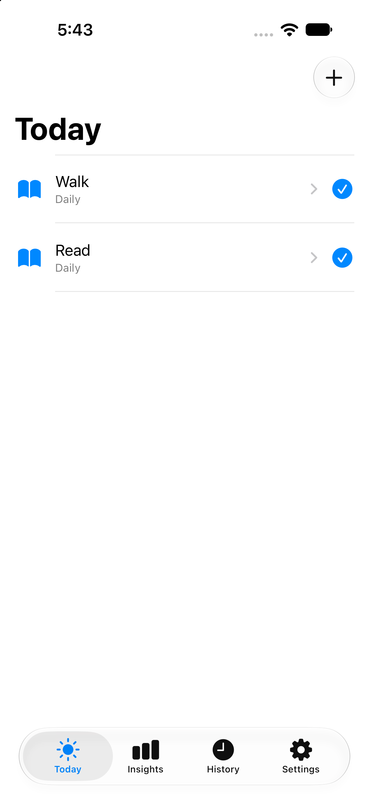

Correctly anchored, clear checkmark on the active selection, no issues.

**F14 (positive) — Insights' insufficient-data state is honest and the
disabled "Next" control is visually distinct from the enabled "Previous" one.**
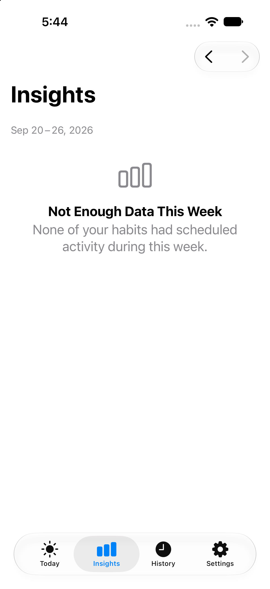

Exactly matches "treat missing data differently from a measured zero," and
extends that honesty to the visual design, not just the copy.

**F16 — No brand accent color or app icon exists yet.**
There is no `AccentColor.colorset`; every tinted element (checkmarks, links,
selected states) uses the stock iOS system blue, and `AppIcon.appiconset` is
an empty 1024×1024 slot. Expected and already acknowledged in README.md as a
pre-distribution gap — restated here because it's the direct target of Part
2's three visual directions below.

**F17 — Accessibility compliance is unverified, not confirmed either way.**
Code consistently sets `.accessibilityIdentifier`/`.accessibilityLabel` on
interactive elements and uses scalable system text styles throughout — a
good sign — but Dynamic Type overflow at the largest accessibility sizes,
actual VoiceOver focus order, Reduce Motion behavior (no motion exists yet to
reduce, so moot today but relevant once animations are added), and dark-mode
contrast have not been empirically verified in this pass. Needs a real
device/Simulator.app + Accessibility Inspector session before shipping.

---

## Part 2 — Three visual directions

All three keep native controls, system typography, and the existing card-
based layout language already established in `HabitDetailView`/
`SettingsView`/`InsightsView` — this is a color/personality proposal, not a
structural redesign. Each is chosen to extend cleanly to the companion's six
states (`calm`, `focused`, `nearLimit`, `overloaded`, `recovering`,
`celebrating`) later, per DESIGN_SYSTEM.md, without a second rebrand —
*described*, not implemented, per this pass's constraints.

### Direction A — "Calm Sage" (recommended)

A muted sage/teal-green primary accent on warm off-white/cream surfaces
(replacing pure white), deep charcoal (not pure black) text. Success states
use the same sage; "needs attention" uses a soft amber, never red. This is
the most literal translation of VISION.md's own words — "calm, not
punitive," "insightful, not data-heavy" — into color: nothing in this
palette reads as an alarm, which matters directly for Insights' "needs
attention" callout and for avoidance ("Cut Down") habits, where a red/orange
treatment would risk looking like a failure state. Extends naturally to
companion states: sage = calm/focused, amber = nearLimit/recovering, a
deeper clay = overloaded (still warm, not alarm-red), soft gold =
celebrating.

### Direction B — "Focused Indigo"

A deeper indigo/blue-violet accent (still blue-family, so the lowest-risk,
most "this already looks like a native iOS app" option), paired with a warm
coral/terracotta used sparingly for "needs attention." Reads as a premium
productivity tool (closer to Things 3/Fantastical's polish level) rather
than a wellness app. Safer and faster to implement since it's closest to the
current system-blue baseline; least differentiated from "another blue iOS
app," which is a real risk given APPLE_COMPLIANCE.md's "not a reskinned
template" review posture.

### Direction C — "Warm Terracotta"

A warm terracotta/clay primary accent with deep charcoal text on cream
backgrounds, muted teal as the secondary/success accent. The most visually
distinctive of the three — sets up the eventual spirit-animal companion with
a warm, earthy, approachable personality from day one instead of retrofitting
warmth onto a cooler palette later. Highest brand-differentiation reward,
but the highest execution risk: terracotta-as-primary is unusual enough for
a productivity app that it needs careful contrast/legibility work to read as
"premium" rather than "craft blog."

### Recommendation

**Direction A (Calm Sage).** It satisfies VISION.md's stated principles most
directly, needs no red/alarm palette ever (removing a whole category of
future "does this look punitive?" design debates around recovery and
avoidance habits), and its three-tier warm/neutral/amber structure maps onto
the companion's six states without inventing new colors later. Direction B
is the pragmatic fallback if the team wants the smallest visible change;
Direction C is the highest-upside, highest-risk bet worth prototyping only
if brand differentiation is judged more urgent than low implementation risk
right now.

---

## Part 3 — Proposed improvements to core flows

These are proposals for a future slice, not changes made now.

1. **Today**: once a visual direction is chosen, use its calmer accent for
   the empty state's "Create Habit" link and consider a filled (not
   text-only) button there for discoverability — to validate via the
   usability script, not assumed.
2. **Habit form**: switch to inline title display mode (F4) — essentially
   free, no visual-direction dependency.
3. **Today row copy**: thread polarity into the completion affordance (F2) —
   e.g., avoidance habits read "Mark avoided" / "Undo" with matching
   VoiceOver labels, positive habits keep current copy. Scoped copy change,
   not a redesign.
4. **History icon tinting**: resolve F12 by choosing one rule — either tint
   active habits' icons consistently everywhere (Today, Detail, History) and
   reserve gray exclusively for archived, or keep History monochrome
   everywhere and move the archived signal entirely onto the text badge
   (already present) so no screen uses icon color as a second, conflicting
   archived indicator.
5. **Insights summary layout**: once Part 0's Rule 1/2 fixes land, design the
   "balanced summary" sentence's placement explicitly (e.g., it replaces
   *both* callout slots with one centered sentence: "All 3 habits were
   equally consistent this week (82%)") so engineering has a concrete layout
   target instead of inferring one.
6. **Today's empty space (F1)**: earmark the blank area below a short habit
   list as the future companion's eventual home, rather than filling it with
   an ad hoc summary now that would need to be redesigned again later.

---

## Part 4 — Component/state inventory (for Figma)

Organized by current SwiftUI source so design and engineering names match.

| Component | Source | States to design |
|---|---|---|
| TabBar | `AppShellView` | selected / unselected × 4 tabs |
| NavBar — large title | Today, Insights, History, Settings, Archived Habits | default; with trailing toolbar action(s); with leading+trailing (Insights' Previous/Next) |
| NavBar — inline title (proposed fix, F4) | Habit form sheet | Cancel/Save enabled, Save disabled (invalid) |
| HabitRow (Today) | `TodayView.HabitRowView` | incomplete; completed; flexible-weekly with progress; (proposed) avoidance-phrased |
| HabitRow (History) | `HistoryView.HistoryRowView` | completed; skipped (with/without reason); archived badge present/absent |
| HabitRow (Archived list) | `ArchivedHabitsView` | default + Reactivate button |
| EmptyStateView (ContentUnavailableView) | Today, History (×2: no filter / filtered), Archived Habits, Insights (×2: no habits / insufficient data) | each: icon, title, description, optional action |
| HabitFormView | sheet | create vs. edit title; schedule kind = daily/weekdays/timesPerWeek; icon cell selected/unselected; weekday chip selected/unselected; validation invalid |
| HabitDetailView sections | push destination | header card; Schedule card; Streak card (with/without recovery message); Consistency card (data / "not enough data"); View History row; Archive row / "This habit is archived" banner |
| ConfirmationDialog (Archive) | `HabitDetailView` | **needs an explicit Cancel affordance in the spec**, pending F9's resolution |
| SettingsRow | `SettingsView` | single entry state (room to add more rows later) |
| InsightsSummaryCard | `InsightsView` | populated (overall %, trend, strongest, needs-attention); **balanced-summary (new, from Part 0/3)**; insufficient-data; no-habits |
| WeekNavigator | `InsightsView` toolbar | both enabled; Next disabled (at most recent completed week) |
| Toolbar "+" (Today) | `TodayView` | default |
| Toolbar Picker/Menu (History filter) | `HistoryView` | collapsed; expanded with checkmark on selection |
| Badge — "Archived" | `HistoryView.HistoryRowView` | present only |
| Accessibility annotations | all of the above | Dynamic Type at default and largest accessibility size; VoiceOver label per interactive element (already present in code — carry into Figma as annotations, not just visuals) |

---

## Part 5 — Usability test script (short)

~15–20 minutes, moderated, think-aloud. Fresh install state each time.

1. "You've just installed Avela. What would you do first?" — *tests empty-
   state discoverability (F1, F3-hypothesis).*
2. "Create a habit to drink more water, and mark today's as done." —
   *creation flow, completion affordance.*
3. "Oops — you tapped complete by accident. Undo it." — *undo discoverability.*
4. "Open that habit's details. In your own words, what does the streak and
   consistency information tell you?" — *comprehension of streak/consistency
   framing, and whether the mix of "no data yet" phrasings (F7) reads as
   inconsistent.*
5. "You've decided to stop tracking this habit for now." — *archive
   discoverability and, critically, whether they can find their way back out
   of the confirmation if they change their mind (F9).* Then: "Now bring it
   back." — *reactivation via Settings discoverability.*
6. Show a pre-seeded account with a week of mixed habit data (needed: the
   DEBUG fixture below). "Look at your Weekly Insights. How did this week go
   compared to last week, in your own words?" — *comprehension of trend
   language, and whether a "Strongest"/"Needs Attention" overlap (Part 0,
   Rule 2) reads as confusing or contradictory once visible.*
7. Point to a habit shown on both Today and History. "What does the gray
   icon here mean, compared to the blue one there?" — *directly probes F12.*

Debrief: "Did anything in this app feel punitive, judgmental, or guilt-
inducing at any point?" · "Was there a moment you weren't sure what would
happen before you tapped something?" · "Did the 'Cut Down' habit feel
different to use than the 'Build Up' one, and should it?"

---

## Part 6 — Phased implementation plan

**Phase 1 — Correctness (ship before any visual work): DONE.**
- ~~Fix Insights trend cohort/schedule-compatibility gating (Part 0, Rule 1).~~
  Fixed — see `docs/DATA_MODEL.md`'s "Trend comparable-cohort rules."
- ~~Fix Insights balanced-summary logic for identical-result weeks (Part 0,
  Rule 2).~~ Fixed — `isBalancedWeek`, see "Audit-driven correctness fixes."
- ~~Diagnose and resolve the archive confirmation dialog's missing Cancel
  affordance (F9).~~ Fixed — switched to a native `.alert`.
- ~~Add regression tests for all three.~~ Done: 7 new
  `WeeklyInsightsCalculatorTests`, 1 new archive-cancellation UI test, 5 new
  populated-Insights UI tests backed by DEBUG fixtures (see below).

**Phase 2 — Low-risk copy/consistency fixes (no visual-direction dependency): DONE.**
- ~~`HabitFormView`: inline title display mode (F4).~~ Fixed.
- ~~Polarity-aware Today completion copy (F2).~~ Fixed — `HabitPolarityFormatter`.
- ~~Resolve the History-vs-Today/Detail icon-tint inconsistency (F12).~~ Fixed.
- ~~Copy pass on habit detail's "nothing yet" strings for a shared pattern
  (F7).~~ Fixed — "No current streak yet."
- ~~Icon-grid touch-target measurement and fix (F5 — moved up from Phase 4
  once measurement turned up a confirmed 36pt violation, not just a
  hypothesis).~~ Fixed — adaptive grid, 44pt minimum, Dynamic-Type-aware.

Also captured as part of this phase: real light/dark screenshots (F12
evidence) and a confirmed finding that `-UIUserInterfaceStyle` as a UI-test
launch argument does not work on this toolchain — see
`docs/DATA_MODEL.md`'s "Accessibility checks that could not be performed."

**Phase 3 — Visual design system foundation:**
- Choose a direction (recommend A); add `AccentColor` and any semantic
  color assets (success/attention tokens), confirm against existing
  typography (no new type scale needed — system fonts already in use).
- Apply as a color-only pass to existing components first; verify light and
  dark mode — real screenshots of both now exist (F12), captured via
  `simctl ui ... appearance`, so this phase has a working method ready to
  reuse, not a gap to solve first.

**Phase 4 — Structural UX refinements:**
- Today's empty-space treatment (F1) — intentionally deferred until a
  concrete answer exists for what belongs there (see Phase 5).
- Insights summary card layout refinement under a chosen visual direction —
  Phase 1's logic is done and real populated screenshots now exist (see
  F15), so this is purely visual polish, not blocked on correctness anymore.

**Phase 5 — Future-surface readiness (no implementation):**
- Reserve the chosen palette's mapping to the companion's six states so
  Phase 4 of the product roadmap doesn't require a second rebrand.
- Note where an attention-budget card could slot into Today/Insights without
  restructuring either screen later.

---

## Smallest DEBUG fixture approach for populated-Insights screenshots — IMPLEMENTED

This was originally proposed here, not implemented, for a future pass to
pick up. It was implemented in the same-day correctness follow-up: see
`docs/DATA_MODEL.md`'s "Populated-Insights DEBUG fixtures" for the shipped
design (`Avela/App/DebugFixtures.swift`, five named fixtures, activated via
`AVELA_UI_TEST_SEED_FIXTURE` and gated behind `AVELA_UI_TEST_STORE_PATH`
already being set), exactly along the lines sketched below, and F15 above
for the resulting screenshots. Verified absent from Release binaries the
same way `AVELA_UI_TEST_STORE_PATH` was originally verified: `grep` for the
override's name, the fixture enum's name, and the store-path variable name
in the compiled Release binary all return zero matches.

The original proposal, left here for reference:

> The project already has a proven, audited precedent:
> `AVELA_UI_TEST_STORE_PATH`, gated `#if DEBUG` and verified absent from
> Release binaries (see `docs/DATA_MODEL.md`'s "Phase 1 Today UI"). The
> smallest extension of that same pattern: a second `#if DEBUG`-gated launch
> environment variable that, when present, has `AvelaApp` insert a small
> number of habits with past `createdAt` dates directly through the
> repository right after opening the (still isolated, still test-only)
> store — mirroring exactly how `HistoryViewModelTests`/
> `InsightsViewModelTests` already construct past-dated fixtures in unit
> tests, just reachable from a real launched app instance instead of only
> from XCTest.
