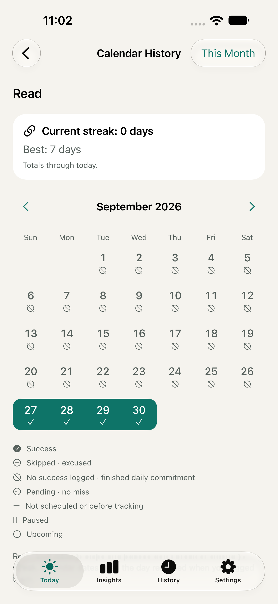
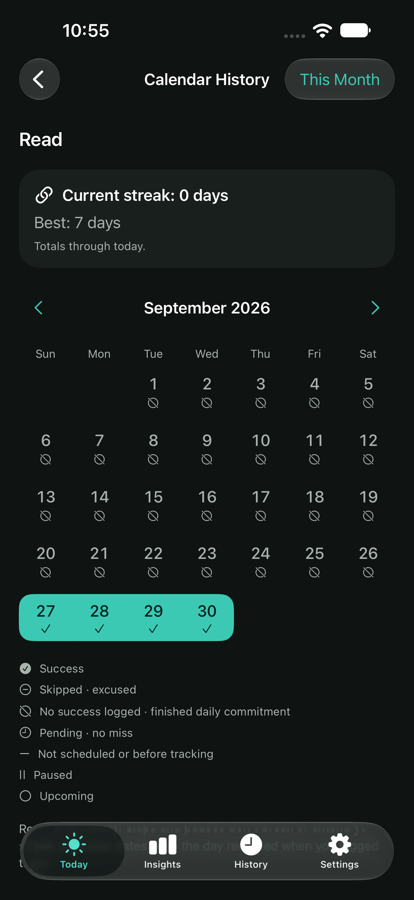
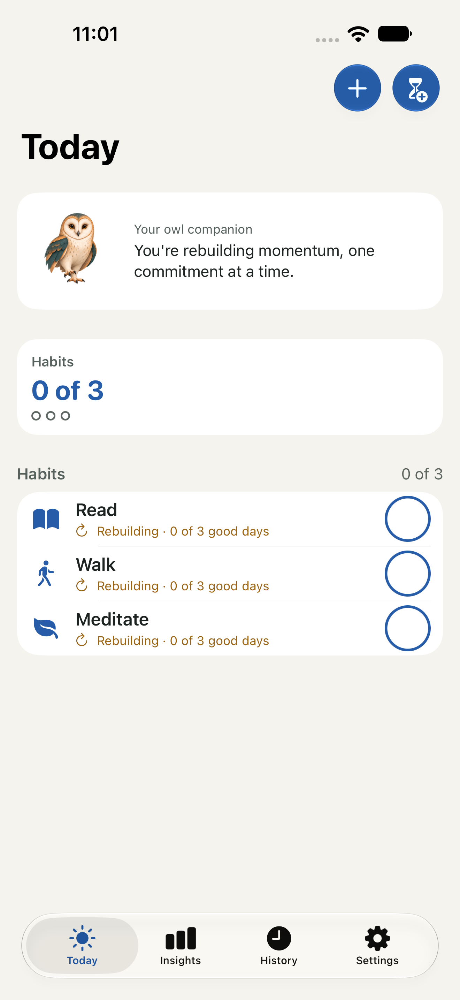
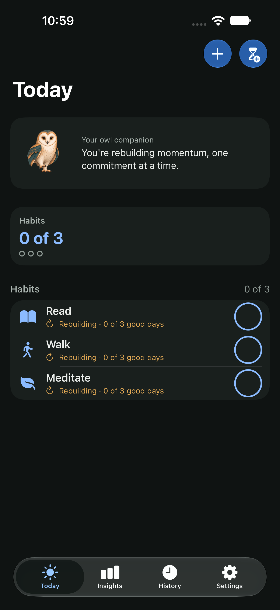
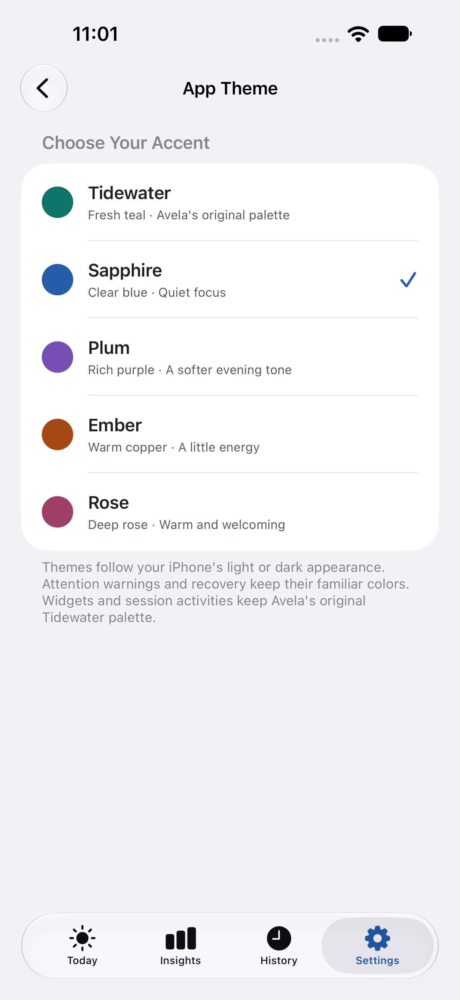
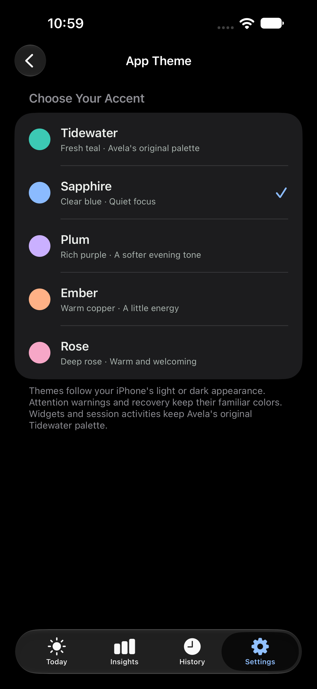
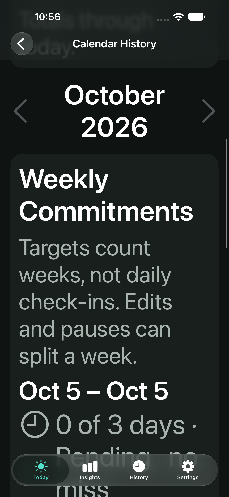

# Native calendar and theme previews

Captured from the native iOS 27 simulator, using isolated DEBUG stores and
example data, 2026-10-05. These are app screenshots, not browser mockups.
Screens reflect their named system appearance; large-text screenshots use AX3.

Open Habit Detail → Calendar History for read-only month navigation, or
Settings → App Theme to choose Tidewater, Sapphire, Plum, Ember or Rose.
Themes change the app accent; warnings/recovery keep their semantic colours,
and widgets/Live Activities retain Tidewater.

## Calendar history

## Sapphire Today

## Theme selection

## Large-text weekly history

Weekly commitments move before the date list. The list omits unrecorded upcoming
and pre-tracking dates with an explicit explanation; the regular grid includes
all dates. Content scrolls without shrinking the user's selected text size.

Physical-device VoiceOver and Increase Contrast remain manual release checks.
