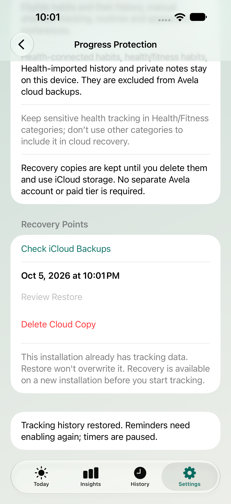

# Private recovery verification — 2026-10-05

## Scope and actual status

Optional dated private CloudKit backup and empty-install recovery are implemented.
The local SwiftData schema/configuration remains unchanged. Current signing has
no real CloudKit container; Release hides the unavailable entry. This is not
operational iCloud protection until the signed-device gates in SETUP.md pass.
There is no live sync, developer backend, AI processing or third-party SDK.

## Native test evidence

423 unit tests and four targeted UI tests passed, zero failures, in one native
xcodebuild test run. Ten of the unit tests exercise recovery. The UI cases cover:

- An unconfigured build never claims protection or enables cloud opt-in.
- Fake-cloud delete cancellation, restore preview cancellation, confirmed recovery
  and persistence across app relaunch.
- Privacy remains accessible without Premium, with updated truthful local/cloud copy.
- Private reflection Save/Cancel/relaunch remains unaffected.

This is not a fresh run of all 85 available UI tests. The fake provider is gated
behind both existing isolated Debug test variables and never accesses a real cloud
account or user store. The screenshot below is native UI with that provider; it
is evidence of local recovery flow, not an actual CloudKit recovery.



Unit coverage includes original IDs, dates, schedule revisions, archive windows,
completion/skip history and reopening a restored disk store; attention budgets,
usage/check-ins/sessions, intentions, quantities, routines and appearance/profile;
Health/fitness/connected/imported exclusions, reflection/note omission; corrupt
checksums/newer versions/invalid calendar dates/duplicate IDs/cross-habit and
missing parent references; existing history and unsaved-edit refusal; failed
upload/account changes; explicit preview/restore/delete; paused timers, disabled
reminders and no fabricated session success. No model properties were added.

The first native UI pass caught both buttons in a List row firing together; explicit
borderless styling isolates them. Confirmation binding cleanup is deferred so it
cannot discard the selected recovery point before an action executes. Both
recovery actions have 44-point minimum labels. A test originally used distantFuture
as an invalid date, but Foundation's value is within the accepted 1900–9999 range;
it now uses the explicit out-of-range boundary instead. A privacy test's old local-
only headline was updated to match the new disclosed optional cloud behavior.

## Reproduce

```sh
DEVELOPER_DIR=/Applications/Xcode.app/Contents/Developer xcodebuild \
  -project Avela.xcodeproj -scheme Avela -configuration Debug \
  -destination 'platform=iOS Simulator,id=2ACFE418-44EC-4A44-9B2A-1B45BDF1EF38' \
  -derivedDataPath /tmp/AvelaCodexMVP -parallel-testing-enabled NO \
  CODE_SIGNING_ALLOWED=YES CODE_SIGN_IDENTITY=- \
  -only-testing:AvelaTests \
  -only-testing:AvelaUITests/MVPFlowTests/testCloudBackupUnavailableBuildNeverClaimsProtection \
  -only-testing:AvelaUITests/MVPFlowTests/testCloudRecoveryPreviewCancelConfirmAndRelaunch \
  -only-testing:AvelaUITests/MVPFlowTests/testPrivacyIsAccessibleWithoutPremium \
  -only-testing:AvelaUITests/MVPFlowTests/testWeeklyReflectionSaveCancelAndRelaunch test
```

Use an available local simulator ID rather than assuming that UUID exists elsewhere.
Result bundle: /tmp/AvelaCodexMVP/Logs/Test/Test-Avela-2026.10.05_22-00-28--0600.xcresult.
Log: /tmp/avela-backup-verified.log.

## Build and packaging

Debug simulator and Release iPhoneOS builds succeeded after the final copy change.
Release logs: /tmp/avela-backup-final-release-build.log; Debug log:
/tmp/avela-backup-final-debug-build.log. Binary inspection found zero matches for
AVELA_UI_TEST_, DebugFixtures, DebugCloudBackupProvider and cloudBackupRecovery;
the production CloudBackupModel marker is present. Both the app and embedded Watch
contain the UserDefaults CA92.1 manifest declaration. Project plist lint and diff
whitespace checks pass. All 196 source memberships (189 Swift file references,
including seven shared across targets) contain no per-target duplicate sources.

## Compliance and remaining release gates

Apple Guideline 5.1.3 prohibits personal health information in iCloud. Recovery
excludes the whole tracked Health-linked/health/fitness habit to avoid inventing
misses by dropping only Health-derived successes. It also excludes private
reflection/completion notes and validates restrictions again on download.
Sensitive health tracking must not be put in another category to bypass exclusions.
Core tracking remains useful without consent or iCloud. Copies are retained until
explicit deletion, account changes revoke consent, and only acknowledged upload
sets the successful date. An upload already sent can finish after disabling.

The app and embedded Watch ship the privacy manifest with UserDefaults reason
CA92.1 for their own preferences. This corrects the outdated no-UserDefaults audit.
No conclusion that every app privacy response is complete follows from this check.

- Real bundle/team/container, entitlements, schema/indexes and Production deployment.
- Signed upload/account-change/offline/quota/deletion/empty-install restore checks.
- Actual cloud-asset exclusions and Apple's whole-device backup handling for local
  Health-derived records checked before distribution.
- Published privacy policy/contact, actual App Store Connect responses, archive
  privacy report and reviewer steps, per TESTFLIGHT_CHECKLIST.md.
- Real VoiceOver, Increase Contrast and device Dynamic Type checks.

There is no guarantee of App Review acceptance. No commit or push was made.
