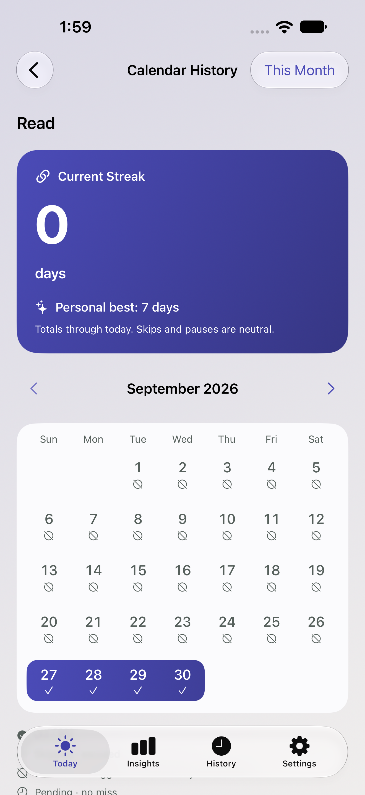
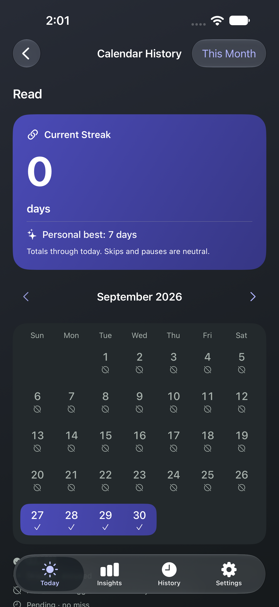

# Full themes and streak presentation

Native iPhone 18 Pro Max simulator captures, 2026-10-05. These show the implemented Indigo theme, not browser mockups. All nine themes share this presentation with their own palette.

| Screen | Light | Dark |
| --- | --- | --- |
| Today | [Preview](today-indigo-light.png) | [Preview](today-indigo-dark.png) |
| Streak calendar | [Preview](calendar-indigo-light.png) | [Preview](calendar-indigo-dark.png) |
| Theme picker | [Preview](themes-indigo-light.png) | [Preview](themes-indigo-dark.png) |

[Accessibility XXXL weekly outcome](weekly-large-text-dark.png) shows the scrolled, reachable pending commitment outcome. Weekly logging remains distinct from a successful daily streak.

Themes now affect page gradients, custom reading-card surfaces, progress heroes and the theme-picker previews. Native form/list cells keep their system surfaces. The calendar emphasizes current and personal-best streaks with a connected success ribbon; totals are through today even when browsing an earlier month. Skips, pauses, pending periods and historical facts retain their existing meaning.

Verification: 346 unit tests and four targeted UI tests passed; the immersive flow and accessibility weekly flow also passed in dark mode. Debug and unsigned iPhone SDK Release builds succeeded. Palette contrast is tested across all nine themes in light/dark, including hero-gradient samples. This does not establish physical OLED, VoiceOver or Increase Contrast behavior; those remain device release checks. No commits or pushes.
