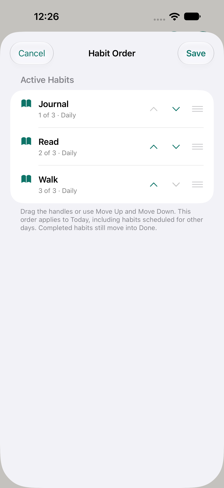
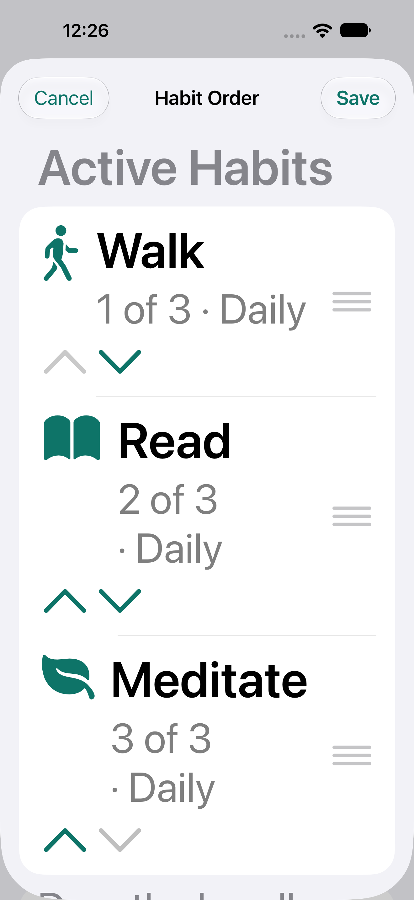

# Native habit ordering previews

Captured on the isolated iPhone 18 Pro Max / iOS 27 simulator, 2026-10-05.
These are real native screens with example data, not browser mockups or owner data.

Today → Order or Settings → Habit Order opens the same free ordering sheet.
Drag handles or Move Up/Down change a draft; Save persists it, Cancel discards it.
Every active habit is included, even if not due today. Done remains grouped
separately, archived habits retain their slots and new habits append.

Native simulator flows verify drag handles, Cancel, Save, relaunch, unchanged History and
completion/undo. Real-device VoiceOver focus and keyboard/drag ergonomics remain
release checks. No schema, permission or dependency was added.
