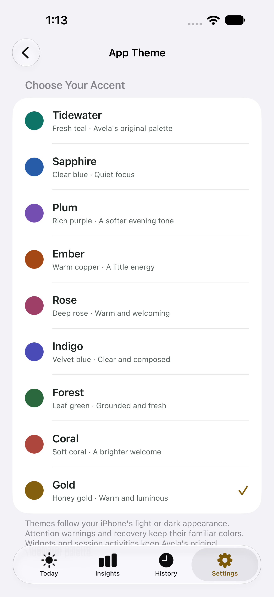
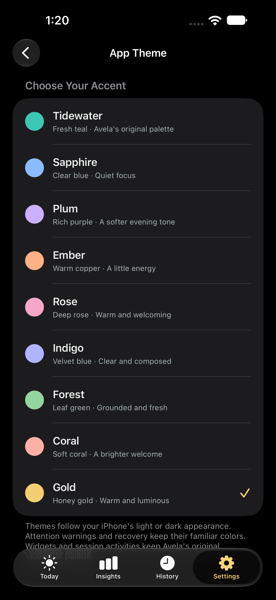
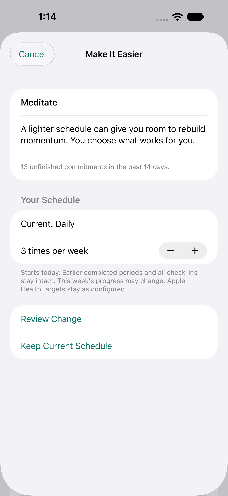
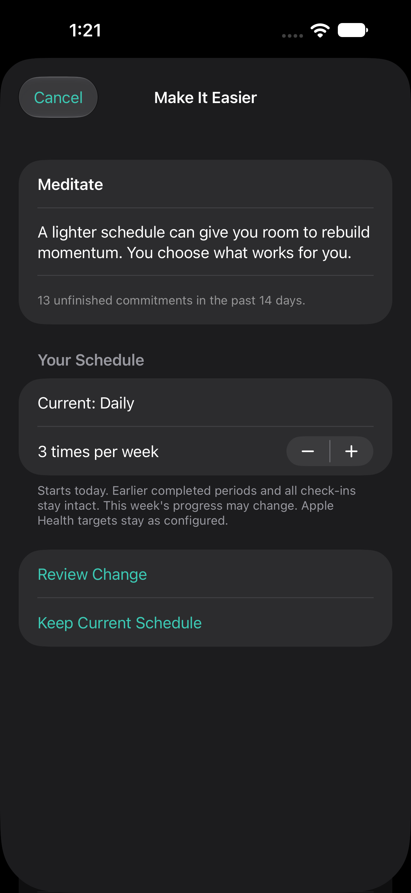
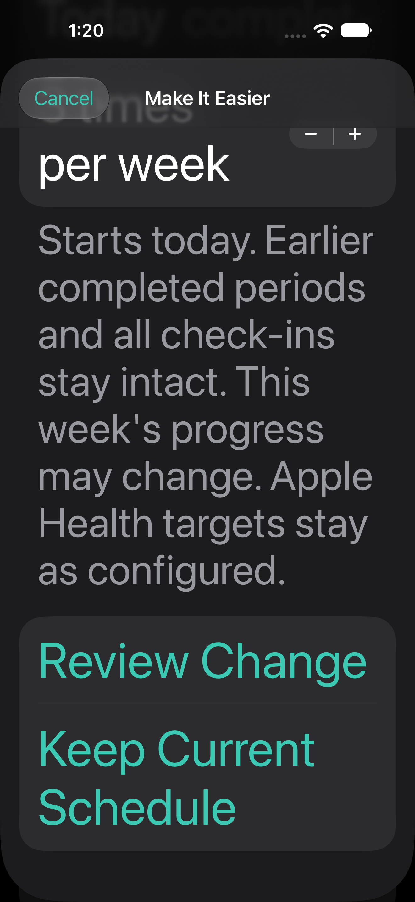

# Native expanded themes and lighter-schedule previews

Captured on the isolated iPhone 18 Pro Max / iOS 27 simulator, 2026-10-05.
Example data uses a DEBUG-only isolated store. These are native screens, not
browser mockups or owner data. No live user store was changed.

Settings → App Theme now offers nine free choices. New accents: Indigo, Forest,
Coral and Gold. Light/dark pairs retain warning/recovery semantics; widgets and
session Live Activities still use Tidewater.

Habit Detail → Make It Easier is offered only for eligible active Build Up habits
with repeated recent resolved misses and ongoing recovery. Opening or cancelling
never changes the schedule. Review shows the current schedule, editable lower
flexible-weekly frequency and effective-today/history explanation, then requires
a separate named confirmation. Prior check-ins remain; this week's progress may
change. Apple Health quantity targets are unchanged.

The accessibility XXXL form scrolls without reducing the requested font size.
This capture is intentionally scrolled to its explanation and reachable actions;
content above remains available by scrolling back.

Native verification results are recorded in SETUP.md. Physical-device VoiceOver,
keyboard use and Increase Contrast remain release checks. Colour intentions and
the suggestion's defaults are design choices, not measured adherence outcomes.
No claim that competing apps lack this capability is made.
